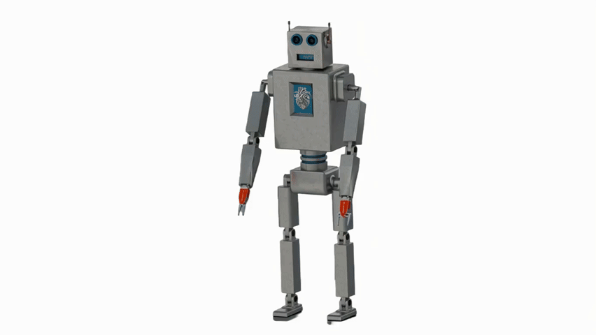
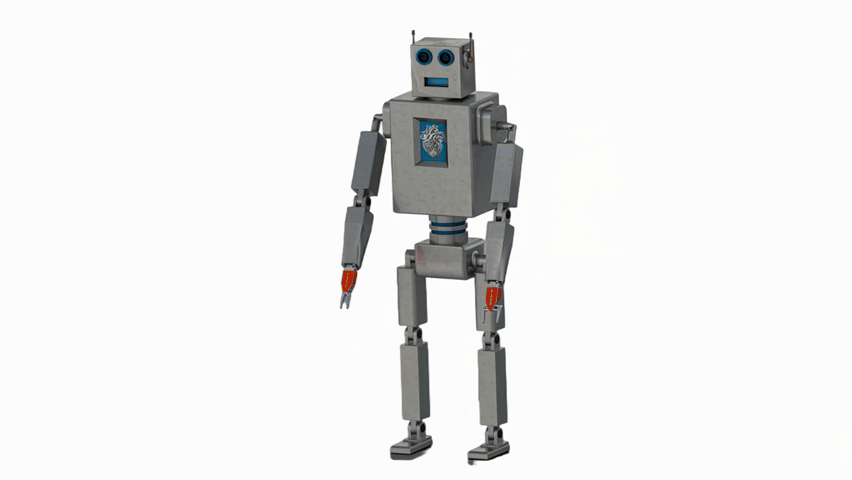

<h1 align="center">WELCOME TO MY GITHUB</h1>

  <h3 align="center">🤖 Feel at home — here you'll find projects in <strong>robotics</strong> and <strong>artificial intelligence</strong>.</h3>
  
- 🎓 **Bachelor of Engineering and Master degree in Automation and Robotics** 
- 🤖 **Specialization in Robotics and Autonomous Systems, from the Poznan University of Technology**
  
---

<h3 align="left">🛠️ Technologies I use:</h3>

  

  
  

